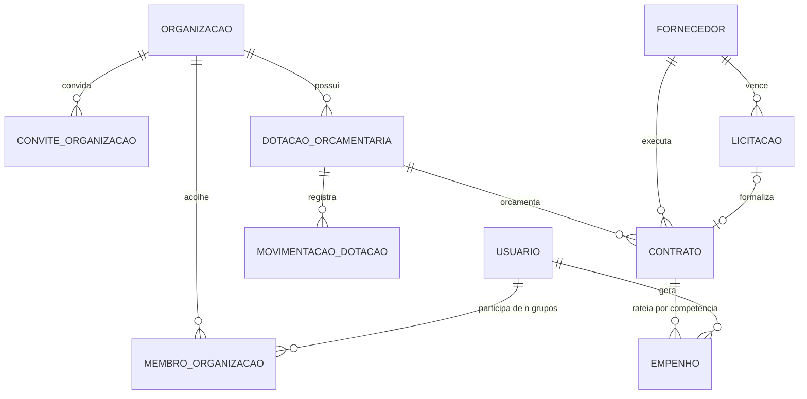
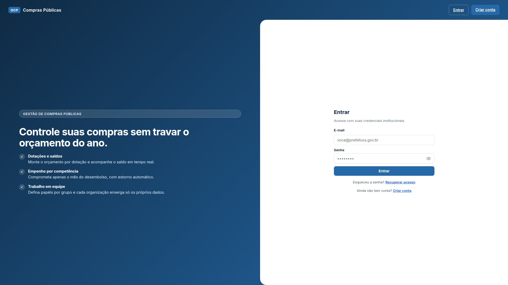
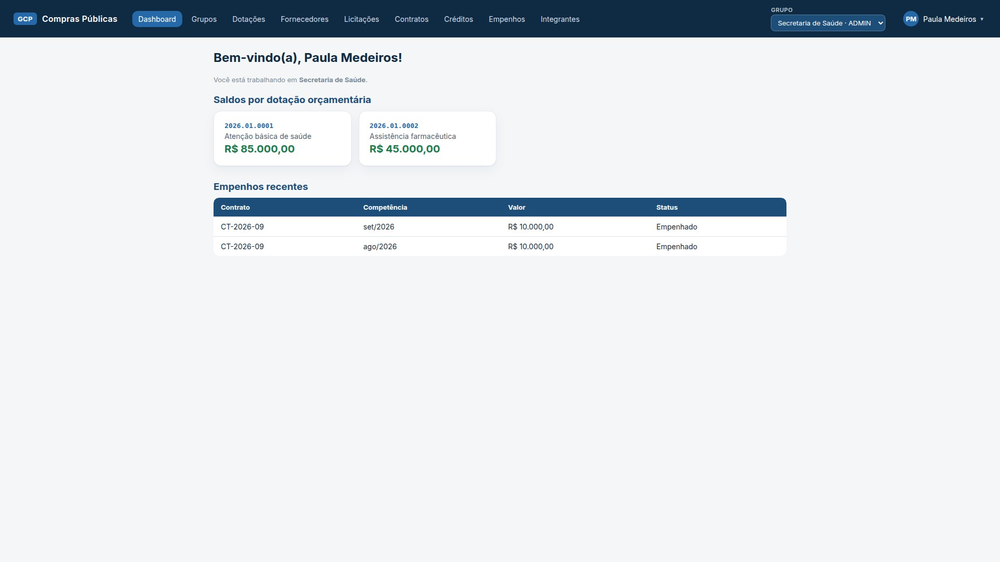
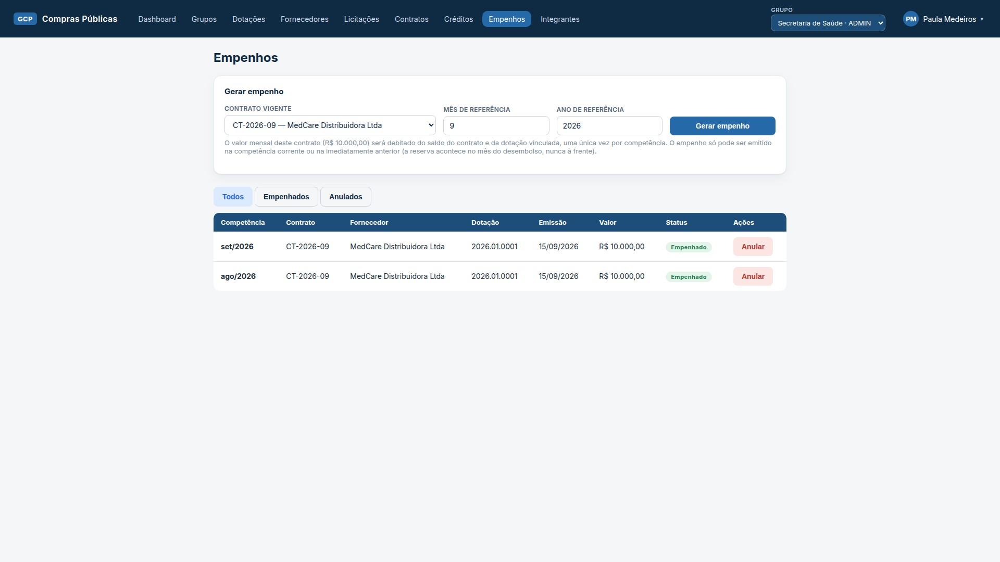

# Sistema de Gestão de Compras Públicas

[](https://github.com/enzo-barbosa/gestao-compras-publicas-api/actions/workflows/ci.yml)

Plataforma full-stack para gestão de despesas públicas municipais com um diferencial de arquitetura: **empenho por rateio mensal** em vez do modelo tradicional de empenhar o valor total do contrato de uma só vez — prática que satura o saldo orçamentário antes do fim do exercício e distorce os relatórios de execução.

## O problema que este projeto resolve

Na gestão tradicional, um contrato de R$ 600.000 gera, no primeiro mês, um empenho dos R$ 600.000 inteiros sobre a dotação orçamentária — mesmo que a despesa ocorra ao longo de 12 meses. Este sistema divide automaticamente:

```
Contrato 014/2026 · R$ 60.000 · 6 meses
├── jan/2026 → empenho de R$ 10.000 ✓
├── fev/2026 → empenho de R$ 10.000 (competência duplicada? bloqueado)
├── mar/2026 → empenho de R$ 10.000 ✓ (anulado? estorno atômico)
└── ...
```

Cada competência é debitada **uma única vez**, com validações de vigência, saldo da dotação e saldo restante do contrato, além de trilha de auditoria completa (`MovimentacaoDotacao` + usuário autenticado via JWT).

## Funcionalidades

- **Dotações orçamentárias** com controle de saldo e histórico auditável de movimentações (crédito inicial, suplementar, débito, estorno)
- **Créditos suplementares** com validação de ano/exercício
- **Fornecedores** com CNPJ validado por dígito verificador (módulo 11)
- **Licitações** nas 9 modalidades das Leis 8.666/93 e 14.133/21, com fluxo de definição de vencedor
- **Contratos** vinculados a dotação + fornecedor (+ licitação opcional), com valor mensal calculado (HALF_UP) e data de término prevista derivada
- **Empenhos mensais** transacionais: competência única por contrato, débito duplo atômico (dotação + contrato), anulação com estorno completo
- **Autenticação JWT** (HS256, 8h) com papéis globais (`SUPER_ADMIN`) e papéis **por grupo/organização** (`ADMIN`/`OPERADOR`/`VISITANTE`) selecionada pelo header `X-Org-Id`
- **Multitenancy por grupos**: cada organização tem seus próprios dotações/fornecedores/licitações/contratos/empenhos — isolamento total entre grupos, com convites por e-mail ou código
- **Frontend React** (Vite + TypeScript) com dashboard de saldos, CRUDs e formulário de empenho com feedback visual

## Stack

| Camada | Tecnologias |
|---|---|
| Backend | Java 21, Spring Boot 4.1.1, Spring Security, JPA/Hibernate 6, Bean Validation |
| Banco | PostgreSQL 15 (Docker), Flyway migrations (V1–V4) + seed controlado |
| Auth | JJWT 0.12.6, filtro de token + membership por grupo, BCrypt |
| Frontend | React 19, TypeScript, Vite, axios, react-router-dom |
| Qualidade | 136 testes (JUnit 5 + Mockito + integração) |

## Como rodar

### Pré-requisitos
Java 21, Docker, Node 20+.

### Backend + banco
```bash
docker compose up -d                 # PostgreSQL na porta 5432
./mvnw spring-boot:run               # API em http://localhost:8080
```

Usuário administrador semeado automaticamente:

```
email: admin@admin.com
senha: admin
```

### Testes e cobertura
```bash
./mvnw test                          # 136 testes
./mvnw verify                        # relatório JaCoCo em target/site/jacoco/
```

### Smoke test da API
```bash
./scripts/test-api.sh                # 22 verificações end-to-end via curl
```

O script cria registros próprios (sufixo único por execução), exercita o fluxo completo — incluindo caminhos negativos (401/400/409) e a matriz de papéis — e imprime o resumo.

### Frontend
```bash
cd frontend
npm install
npm run dev                          # http://localhost:5173 (proxy /api -> :8080)
```

Faça login com o administrador semeado (perfil `SUPER_ADMIN`, já ADMIN da organização "Minha Organização"). Usuários comuns podem ser registrados pelo endpoint `POST /api/auth/register` (exclusivo de nível administrador).

**Endpoints de negócio exigem o header `X-Org-Id`** apontando a organização ativa do usuário (ex.: `X-Org-Id: 1`). Quem não é membro da organização recebe `403` "Você não é membro desta organização.".

## Desenvolvimento

O [`docs/guia-de-desenvolvimento.md`](docs/guia-de-desenvolvimento.md) documenta o processo de construção do projeto: fases, decisões arquiteturais, plano de commits e histórico de sessões de desenvolvimento.

## Diagramas

Os diagramas Mermaid estão em [`docs/diagramas/`](docs/diagramas/) e são renderizados nativamente pelo GitHub:

- [`modelo-dados.mermaid`](docs/diagramas/modelo-dados.mermaid) — entidades e relacionamentos
- [`fluxo-empenho.mermaid`](docs/diagramas/fluxo-empenho.mermaid) — árvore de decisão da regra central (geração e anulação)
- [`arquitetura-aws.mermaid`](docs/diagramas/arquitetura-aws.mermaid) — desenho de deploy proposto (ECS Fargate + RDS + S3/CloudFront)

Prévia do modelo de dados:



## Principais endpoints

> Endpoints de negócio (`/api/dotacoes`, `/api/fornecedores`, `/api/licitacoes`, `/api/contratos`, `/api/empenhos`, `/api/creditos-suplementares` e a **gestão de membros/convites**) operam **sempre na organização do header `X-Org-Id`** — o papel do usuário é resolvido dentro daquela organização.

| Método | Rota | Descrição | Acesso |
|---|---|---|---|
| POST | `/api/auth/login` | Autenticação, retorna JWT | público |
| POST | `/api/auth/register` | Cadastro aberto (perfil `USUARIO`) | público |
| GET | `/api/auth/me` | Usuário + lista de organizações com o papel em cada uma | autenticado |
| POST/GET/PUT | `/api/organizacoes` | Criar grupo (quem cria vira ADMIN), listar os meus, renomear | criador: qualquer autenticado; renomear: ADMIN |
| GET | `/api/organizacoes/{id}` | Detalhes do grupo | membro |
| GET/POST/PUT/DELETE | `/api/organizacoes/{id}/membros` | Listar/adicionar/alterar papel/remover membros | leitura: membro; gestão: ADMIN |
| POST/GET/DELETE | `/api/organizacoes/{id}/convites` | Criar convite (por e-mail **ou** código), listar pendentes, revogar | ADMIN |
| POST | `/api/convites/aceitar` | Aceitar convite por código | autenticado |
| POST | `/api/convites/aceitar-email` | Aceitar convites pendentes do meu e-mail | autenticado |
| GET/POST/PUT/DELETE | `/api/dotacoes/**` | Dotações, saldo e movimentações | leitura: todos os papéis; escrita: ADMIN/OPERADOR |
| GET/POST/PUT/DELETE | `/api/fornecedores/**` | Fornecedores (busca por nome) | leitura: todos os papéis; escrita: ADMIN/OPERADOR |
| GET/POST/PUT/DELETE | `/api/licitacoes/**` | Licitações + filtro status/modalidade | leitura: todos os papéis; escrita: ADMIN/OPERADOR |
| PUT | `/api/licitacoes/{id}/vencedor` | Define vencedor e encerra | ADMIN/OPERADOR |
| GET/POST/PUT/DELETE | `/api/contratos/**` | Contratos + filtros | leitura: todos os papéis; escrita: ADMIN/OPERADOR |
| POST | `/api/empenhos` | Gera empenho da competência | ADMIN/OPERADOR |
| DELETE | `/api/empenhos/{id}` | Anula com estorno atômico | ADMIN/OPERADOR |

Erros seguem envelope único `{ timestamp, status, erro, mensagem, detalhes }` — as mensagens de negócio ("Saldo insuficiente na dotação…", "Já existe empenho do contrato… para a competência…") chegam prontas para exibição. Acesso indevido a um grupo retorna `403` "Você não é membro desta organização."; o criador do grupo não pode ser rebaixado nem removido.

## Regras de negócio em destaque

1. **Competência imutável**: existe no máximo um empenho por contrato/mês/ano (controle de unicidade na aplicação — status ANULADO não bloqueia recriação).
2. **Débito duplo atômico**: gerar empenho debita dotação e contrato na mesma transação; qualquer falha reverte tudo.
3. **Vigência respeitada**: só se empenha competência dentro do período do contrato, e apenas com contrato VIGENTE.
4. **Imutabilidade contratual**: valor total, duração e vínculos não mudam após a criação — protege a integridade do rateio.
5. **Rateio que fecha exato**: cada competência empenha o valor mensal (HALF_UP); a última competência da vigência absorve o resíduo de arredondamento — a soma das parcelas é sempre igual ao valor total, independente da ordem de criação dos empenhos.
6. **Trilha de auditoria dupla**: toda variação de dotação gera `MovimentacaoDotacao` tipada; todo empenho registra o usuário autenticado.

## Prints do sistema





## Roadmap

- [x] Fases 0–9: backend completo (dotações → créditos → fornecedores → licitações → contratos → empenhos → JWT)
- [x] Fase 10: frontend React completo
- [x] Fase 11: cobertura de testes, diagramas, smoke script e README
- [x] Fase 12a: CI com GitHub Actions (testes, cobertura, lint) e imagens Docker publicadas no GHCR
- [ ] Fase 12b: deploy em nuvem gerenciada (candidatos avaliados: Oracle Always Free, DigitalOcean via GitHub Student Pack, Render + Neon)

### Programa multitenancy por grupos (5 fases)

- [x] Fase 1 (backend): modelo de dados (organizações/membros/convites), isolamento por `X-Org-Id`, papéis por grupo, `SUPER_ADMIN` global e migração dos dados existentes
- [x] Fase 2 (backend): API de grupos/membros/convites + cadastro público
- [x] Fase 3 (frontend): landing, cadastro, onboarding e seletor de grupo + dashboard
- [ ] Fase 4 (frontend): gestão de membros e painel oculto de super admin
- [ ] Fase 5 (fechamento): revisão de docs, diagramas e `scripts/test-api.sh`
